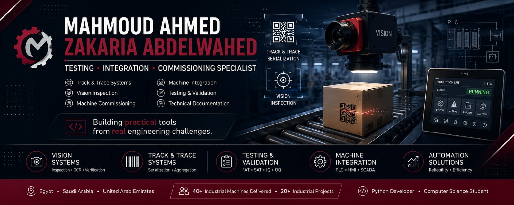

<div align="center">



# Hi 👋, I'm Mahmoud Ahmed Zakaria Abdelwahed

### Testing, Integration & Commissioning Specialist

**Track & Trace • Vision Systems • Machine Commissioning**

<h3>
<span style="color:#7BCB68;">
Turning Real Engineering Challenges into Practical Software
</span>
</h3>


<br><br>

<a href="https://www.linkedin.com/in/mahmoud-zakaria-72748b194/" target="_blank">

</a>

<a href="mailto:mahmoudzakaria25@hotmail.com">

</a>


</div>

---

## 👨‍💻 About Me

I'm a **Testing, Integration & Commissioning Specialist** specializing in **Track & Trace**, **Vision Inspection**, and **Machine Integration** for industrial manufacturing systems.

Throughout my career, I have contributed to delivering **40+ industrial machines** across **Egypt**, **Saudi Arabia**, and the **United Arab Emirates**, participating in more than **20 industrial projects** from commissioning through final customer acceptance.

Currently, I'm pursuing a **Bachelor of Science in Computer Science**, while building practical desktop applications that solve real engineering challenges encountered during testing, commissioning, and production support.

I believe that the best software starts with a real problem—not just an idea.

---

## 🚀 Career Highlights

<p align="center">

<table>
<tr>

<td align="center" width="180">

## 🏭

# 40+

Industrial Machines

Delivered

</td>

<td align="center" width="180">

## 🚀

# 20+

Industrial

Projects

</td>

<td align="center" width="180">

## 🌍

Egypt 🇪🇬

Saudi Arabia 🇸🇦

UAE 🇦🇪

</td>

<td align="center" width="180">

## 🎓

B.Sc.

Computer Science

(In Progress)

</td>

</tr>
</table>

</p>

---
## ⚡ Core Expertise

| Track & Trace | Vision Systems | Commissioning | Testing |
|:-------------:|:--------------:|:-------------:|:--------:|
| 🏷 Serialization | 📷 Inspection | ⚙ FAT / SAT | 🧪 Validation |
| Aggregation | OCR | Startup | Integration |
| Production Tracking | Barcode Verification | Performance Testing | Documentation |

---

# 🛠 What I Do

- Industrial Machine Testing
- Machine Commissioning
- Machine Integration
- Track & Trace Systems
- Vision Inspection
- Production Line Validation
- Technical Documentation
- Process Improvement
- Python-based Engineering Tools

---

## 💻 Tech Stack

<div align="center">

### Programming & Development

<p>

</p>

### Industrial Technologies

<p>


</p>

</div>

---

## ⚙ Technologies I Work With

| Industrial | Software |
|------------|----------|
| Track & Trace | Python |
| Vision Inspection | MySQL |
| Serialization | SQLite |
| Machine Commissioning | Git |
| Machine Integration | GitHub |
| FAT / SAT | VS Code |
| Testing & Validation | Desktop Applications |


---

# 📊 GitHub Dashboard

<div align="center">


</div>

<div align="center">


</div>

<div align="center">


</div>

---
# 🏆 Achievements

<p align="center">


</p>

---

# 🏗 Engineering Solutions

<table>

<tr>

<td width="50%">


### 🏭 Test Executor

**Industrial Machine Testing Platform**

Desktop application designed to execute, organize, and document industrial machine testing workflows.

**Key Features**

- Automated Test Execution
- Test Reporting
- Vision Integration
- Database Validation

🔗 **Repository**
https://github.com/Mahmoudzakaria858/Test-Executor

</td>

<td width="50%">

### 📋 Test Manager Tool

**Industrial Test Management**

Desktop application for managing machine test cases, reports, and testing documentation.

**Key Features**

- Test Case Management
- Excel Reports
- Documentation
- Workflow Tracking

🔗 **Repository**
https://github.com/Mahmoudzakaria858/Test-Manager-Tool

</td>

</tr>

<tr>

<td width="50%">

### 🏷 ZPL Label Converter

**Industrial Label Utility**

Desktop tool for editing and converting ZPL labels used in production environments.

**Key Features**

- Label Preview
- Printer Connectivity
- Multi-language Support
- Export Functions

🔗 **Repository**
https://github.com/Mahmoudzakaria858/zpl-label-converter

</td>

<td width="50%">

### 🖨 Print Label Desktop

**Production Label Management**

Desktop application supporting industrial label printing and workflow optimization.

**Key Features**

- Label Printing
- Serialization Support
- Production Workflow

🔗 **Repository**
https://github.com/Mahmoudzakaria858/print-label-desktop

</td>

</tr>

</table>

---
# 💼 Current Focus

- 🏭 Building software for industrial manufacturing environments

- 📷 Improving Vision Inspection workflows

- 🏷 Developing Track & Trace utilities

- 🧪 Simplifying testing and commissioning processes

- 🎓 Completing my Bachelor's degree in Computer Science


---

# 📚 Current Learning

```text
🎓 Bachelor of Science in Computer Science

📖 Software Engineering

🧠 Data Structures & Algorithms

🐍 Advanced Python

🖥 Desktop Application Development

🤖 AI-assisted Software Development

🏭 Industrial Digitalization
```

---
# 💡 Engineering Philosophy

<div align="center">

## "Every software project begins with a real engineering challenge."

I don't build software just to practice programming.

I build practical tools that reduce repetitive work, improve engineering efficiency, and solve real manufacturing challenges.

</div>

---

# 📬 Let's Connect

<p align="center">

<a href="https://www.linkedin.com/in/mahmoud-zakaria-72748b194/">

</a>

<a href="mailto:mahmoudzakaria25@hotmail.com">

</a>

</p>

---

<div align="center">

<div align="center">

## ⭐ Thank you for visiting my profile!

> *Engineering is about solving problems, not just writing code.*


</div>
